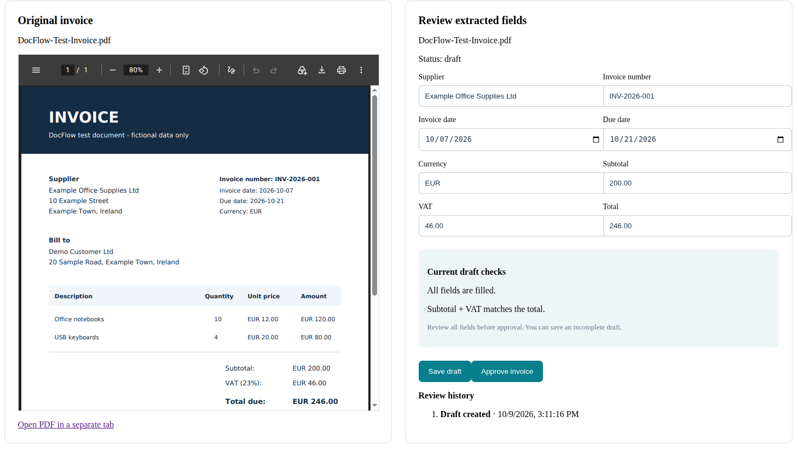
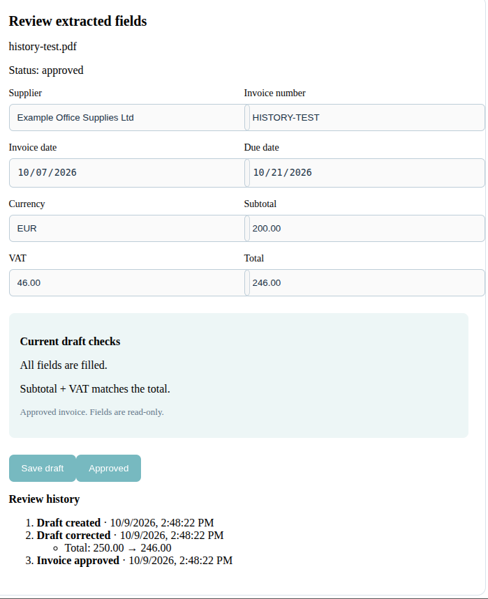
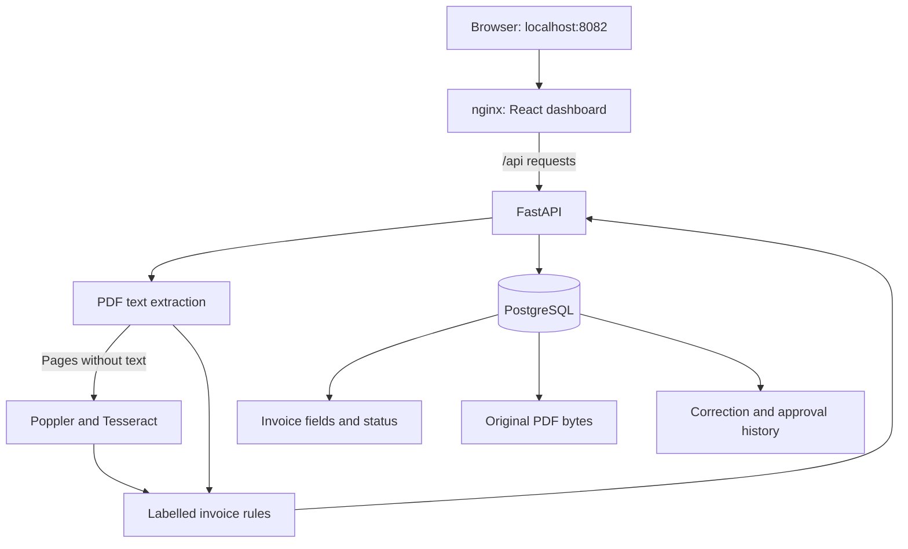

# DocFlow

DocFlow is a local invoice-processing application that extracts PDF text, uses OCR for scanned pages, and provides an editable review and approval workflow.

It combines document processing with PostgreSQL persistence, server-side validation, and a history of saved corrections.

## Features

- Upload PDFs up to 10 MiB and 25 pages.
- Extract selectable text with pypdf.
- Use local Tesseract OCR when a page has no selectable text.
- Extract eight invoice fields using labelled-text rules.
- Preview the original PDF alongside editable fields.
- Save incomplete drafts and reopen them later.
- Validate invoices before approval.
- Make approved invoices read-only through the application.
- Record draft creation, saved corrections, and approval.
- Preserve original PDFs in PostgreSQL.
- Run the complete application with Docker Compose.

## Screenshots

### Invoice review



### Approval history



## Technology stack

| Component | Technology |
|---|---|
| API | Python 3.12, FastAPI |
| Dashboard | React, Vite |
| Database | PostgreSQL 17, psycopg |
| PDF extraction | pypdf |
| OCR | Poppler and Tesseract |
| Frontend serving | nginx |
| Tests | pytest, FastAPI TestClient |
| Automation | GitHub Actions |
| Local deployment | Docker Compose |

## Architecture



The browser calls the API through nginx's `/api` proxy. PostgreSQL stores invoice drafts, document bytes, and history.

Invoice changes and their history entries are written in the same database transaction. Approval locks the invoice row while validating and updating it.

## Run locally with Docker

### Prerequisites

- Git
- Docker with Docker Compose
- Python 3, for generating the local configuration
- A browser

No paid AI API or public hosting is required.

Clone the repository:

```bash
git clone git@github.com:gpatton/docflow.git
cd docflow
```

Create `.env` with a generated local database password:

```bash
python3 - <<'PY'
from pathlib import Path
import secrets

path = Path(".env")
if path.exists():
    raise SystemExit(".env already exists; it was left unchanged.")

password = secrets.token_hex(24)
path.write_text(
    f"DOCFLOW_DB_PASSWORD={password}\n"
    f"DATABASE_URL=postgresql://docflow:{password}"
    "@127.0.0.1:55434/docflow\n"
)
path.chmod(0o600)
print("Local database settings created.")
PY
```

Keep `.env` private. It is excluded from Git and Docker build contexts.

Start the application:

```bash
docker compose up -d --build --wait
docker compose ps
```

Open the dashboard:

http://127.0.0.1:8082

Check the API through the frontend proxy:

```bash
curl http://127.0.0.1:8082/api/health
```

Expected response:

```json
{"status":"healthy","service":"DocFlow"}
```

### Stop and restart

Stop services while preserving data:

```bash
docker compose stop
```

Start them again:

```bash
docker compose up -d --wait
```

PostgreSQL uses a persistent Docker volume. Removing the volume deletes saved invoices, PDFs, and history. Do not run `docker compose down -v` unless you intend to delete that data.

## Demo workflow

Use a fictional EUR invoice with these labelled fields:

- Supplier
- Invoice number
- Invoice date
- Due date
- Currency
- Subtotal
- VAT, such as `VAT (23%): EUR 46.00`
- Total due

For example, use subtotal `200.00`, VAT `46.00`, and total `246.00`.

1. Upload a selectable-text or scanned invoice.
2. Inspect the PDF and extracted fields.
3. Change the total to `250.00`.
4. Save the draft.
5. Attempt approval and observe the totals validation error.
6. Correct the total to `246.00` and approve.
7. Confirm that approved fields are read-only.
8. Refresh and reopen the invoice.
9. Check that its PDF, approved status, and correction history remain available.

The history records saved changes. Edits that are never saved are not recorded.

## Approval rules

The backend requires:

- All eight invoice fields.
- Valid invoice and due dates in `YYYY-MM-DD` format.
- A due date on or after the invoice date.
- Currency `EUR`.
- Non-negative amounts with up to two decimal places and 12 whole digits.
- Subtotal plus VAT equal to total.

Amounts are validated using Python `Decimal`.

Drafts may be incomplete or contain incorrect totals so that reviewers can save work in progress.

Approval prevents subsequent edits through the invoice update endpoint. The original document link cannot be changed after invoice creation.

## API endpoints

| Method | Path | Purpose |
|---|---|---|
| GET | `/health` | Application health |
| POST | `/documents/extract` | Extract and store a PDF |
| GET | `/documents/{id}/pdf` | Retrieve an original PDF |
| POST | `/invoices` | Create a draft |
| GET | `/invoices` | List the latest 100 invoices |
| GET | `/invoices/{id}` | Retrieve an invoice |
| PUT | `/invoices/{id}` | Update draft fields |
| POST | `/invoices/{id}/approve` | Validate and approve |
| GET | `/invoices/{id}/history` | Retrieve review history |

Dashboard requests use these paths with the `/api` prefix through nginx or the Vite development proxy.

## Development outside Docker

Python 3.12 and Node.js 22 are used by the project.

Create the Python environment:

```bash
python3.12 -m venv .venv
source .venv/bin/activate
python -m pip install -r requirements.txt -r requirements-dev.txt
```

Configure `.env` using the instructions above if it does not already exist.

On Ubuntu, install local OCR tools:

```bash
sudo apt-get update
sudo apt-get install poppler-utils tesseract-ocr tesseract-ocr-eng
```

Start PostgreSQL:

```bash
docker compose up -d --wait postgres
```

Start the API in one terminal:

```bash
source .venv/bin/activate
python -m uvicorn app.main:app --reload --host 127.0.0.1 --port 8010
```

Start the dashboard in another terminal:

```bash
cd frontend
npm ci
npm run dev
```

Development dashboard:

http://127.0.0.1:5174

Interactive API documentation:

http://127.0.0.1:8010/docs

Vite proxies `/api` to the development API on port 8010.

## Tests

Run the standard suite from the repository root:

```bash
source .venv/bin/activate
python -m pytest -q
```

Database integration tests are skipped unless explicitly enabled:

```bash
RUN_DB_TESTS=1 python -m pytest -q tests/test_documents_api.py
```

These tests create and remove a temporary database. PostgreSQL must be running, and the configured database user must have permission to create databases.

Integration tests cover:

- PDF byte-for-byte storage and retrieval.
- Invoice document links.
- Missing documents.
- Immutable document links.
- Invoices without documents.

OCR is mocked in these integration tests.

Check the frontend:

```bash
cd frontend
npm run lint
npm run build
```

GitHub Actions runs backend tests, database integration tests, frontend lint, and the frontend build on pushes and pull requests to `main`.

## Logs and troubleshooting

View application logs:

```bash
docker compose logs --tail=100 backend frontend
```

Follow backend logs:

```bash
docker compose logs -f backend
```

If uploads fail, check the file size, page count, PDF validity, and backend logs. Password-protected PDFs are not supported.

If the dashboard cannot reach the API, check:

```bash
docker compose ps
curl http://127.0.0.1:8082/api/health
```

Invoices created before document linking was added have no original PDF attached. Extract a PDF and create a new draft to test persistent previews.

If `python` cannot find pytest, activate the project's environment:

```bash
cd ~/docflow
source .venv/bin/activate
```

## Current limitations

- Local portfolio application; authentication and user isolation are not implemented.
- Extraction uses labelled-text rules, not an LLM or a trained invoice model.
- Supported invoice layouts and currency are intentionally limited.
- OCR runs only when a page has no selectable text.
- Arithmetic validation does not verify tax treatment or invoice authenticity.
- Uploaded documents can remain stored without being linked to an invoice.
- History has no reviewer identity and is not a tamper-proof audit log.
- Schema initialization uses startup SQL rather than versioned migrations.
- The invoice list is limited to the latest 100 entries.
- Existing invoices have history only for actions recorded after history support was added.

## Project structure

| Path | Purpose |
|---|---|
| `app/main.py` | Extraction API and startup |
| `app/invoice.py` | Labelled invoice extraction |
| `app/ocr.py` | Local OCR fallback |
| `app/database.py` | Database connections and schema |
| `app/documents.py` | Original PDF storage |
| `app/invoices.py` | Draft and approval endpoints |
| `app/validation.py` | Approval rules |
| `app/history.py` | Saved correction history |
| `frontend/` | React dashboard and nginx image |
| `tests/` | Unit and database integration tests |
| `.github/workflows/` | Continuous integration |
| `Dockerfile` | Backend image with OCR tools |
| `compose.yaml` | Local application services |
| `requirements.txt` | Backend dependencies |
| `requirements-dev.txt` | Test dependencies |

## License

See [LICENSE](LICENSE).
